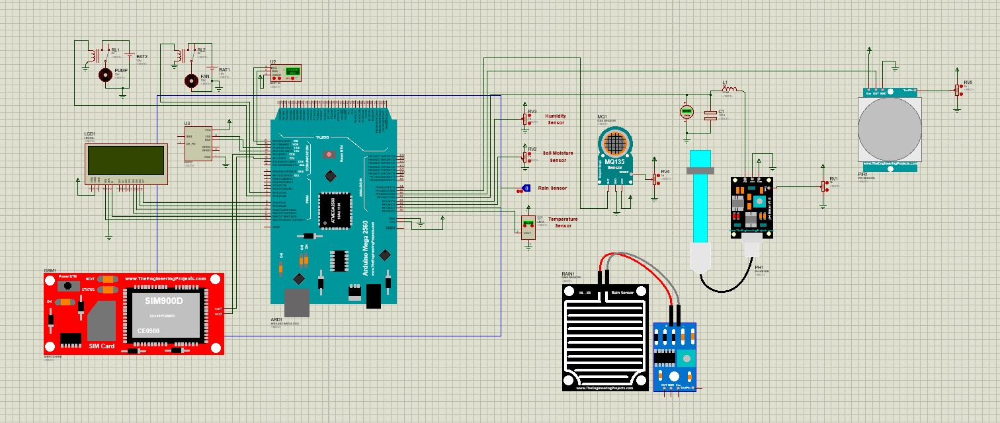
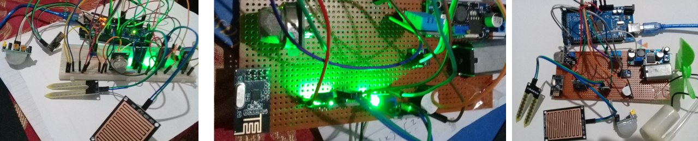
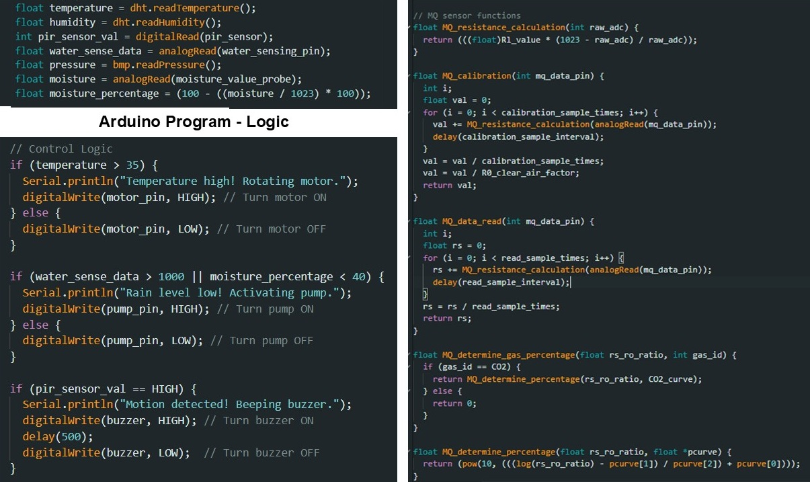
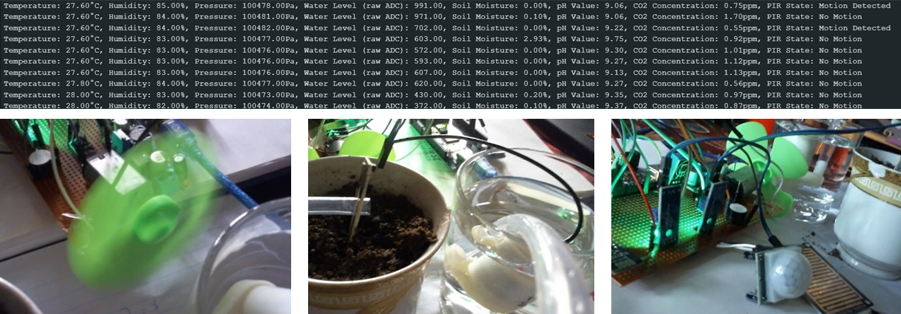
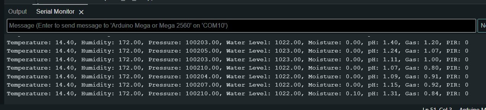
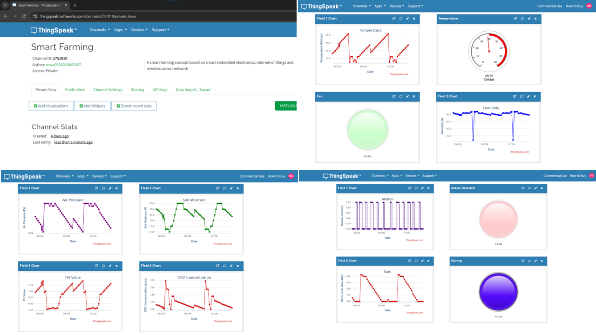

# Automated Smart Farming System: Research-Replica

> This project involved selecting a quality research paper, understanding it, reproducing its results, and presenting the work at the end of the semester.

Developed as part of the Mini Research Project (EN5903) under the guidance of Dr. Samiru Gayan at the **University of Moratuwa (2024)**.

The project is a **reproduction and enhancement** of the ioT-based smart farming system proposed in a research paper by **Mobasshir Mahbub (2019)**, originally released under the **MIT License**.  

This repository includes the exsiting paper detalis, what I implemented and what I modified from the original design.

---

## 📌 Overview

This project implements a practical and enhanced ioT-based smart farming system capable of:
- Environmental condition sensing  
- Automated irrigation  
- Automated cooling  
- Motion detection alerts  
- Cloud-based real-time monitoring  

---

## 📄 Original Research Paper Reference

**Title:** A smart farming concept based on smart embedded electronics, internet of things and wireless sensor network
**Author:** Mobasshir Mahbub (2019)  
**License:** MIT License  

### Parameters Monitored
- Temperature  
- Humidity  
- Air Pressure  
- Rainfall  
- Soil Moisture  
- pH Level  
- CO₂ Concentration  
- Motion (PIR)  

### Key Problems Addressed
- Growing population → lack of food production  
- Unpredictable environmental factors affecting farming  
- Traditional farming challenges (watering, fertilizing, pest control)  
- Labour inefficiency  

### Solutions Proposed
- ioT-based Automated System for monitoring the environmental conditions.
- Alerts sent to farmers or actuators for immediate action. (PIR, Rainfall, Temperature)
- Agri-copters (quadcopters) for precise pesticide and fertilizer application
- Automated fertilization based on real-time soil pH data to maintain soil health
- Cloud-based data visualization and access to historical records
- Off-grid solar PV system for improved power efficiency 
- Agribots are designed for tasks like weeding, planting, and spraying, controlled using IoT. It reduces manual labor and increases efficiency.

---

## 📌 What I Implemented (My Work)

### ✔ Replicated Features
- Integrated all major sensors used in the paper  
- Unified transmitter and receiver circuits into a single working system  
- Arduino Mega 2560 ↔ ESP8266 communication  
- Real-time data upload to ioT dashboard  

### ✔ Improvements / Enhancements
- **Automatic Irrigation System** using a 5V water pump  
- **Automatic Cooling System** using a DC motor + propeller  
- **Motion Detection Alert System** using PIR + buzzer  
- Stable communication between Arduino Mega and ESP8266 to upload data to an **IoT platform** (Thingspeak)

---

## 🔧 Components Used

| Component | Description |
|----------|-------------|
| Arduino Mega 2560 Rev3 | Main controller |
| ESP8266 Wi-Fi Module | ioT/cloud communication |
| DHT11 | Temperature + Humidity |
| BMP180 | Pressure |
| MQ-135 | CO₂ / Air Quality |
| Rain Sensor | Rainfall Detection |
| Soil Moisture Sensor | Irrigation Trigger |
| PIR Sensor | Motion Detection |
| DC Motor + Propeller | Cooling Mechanism |
| 5V Water Pump | Irrigation System |
| Piezo Buzzer | Motion Alert |
| GSM SIM900A | SMS Alerts |
| nRF24L01+PA/LNA | Long-range Wireless Communication |

---

## 🧪 Simulations

> The simulation code was altered to match Proteus and attached in the attachments.

---

## 🖼️ Prototype

---

## 💻 Code

Notes:
- This project uses modified code based on the original MIT-licensed code by Mobasshir Mahbub.
- All modifications and enhancements are documented above.

---

## 🖼️ Prototype, Dashboard & Serial Monitor Outputs

Prototype Outputs

Serial Monitor Outputs

Dashboard Outputs

> The working video of the prototype and dashboard is attached in the attachments.

---

## 📡 **How the System Works**

### **1. Sensor Layer**
Collects environmental data:
- Temperature & Humidity  
- Pressure  
- CO₂ / Air Quality  
- Soil Moisture  
- Rain  
- Motion  

### **2. Processing Layer (Arduino Mega)**
- Processes sensor data
- Controls output devices (pump, fan, buzzer)  
- Sends data to ESP8266  

### **3. IoT Layer (ESP8266)**
- Connects to Wi-Fi  
- Sends real-time data to cloud dashboard  

### 4. Automation Logic Table

| Condition | Action |
|----------|--------|
| Soil moisture low | Water Pump ON |
| High temperature | Cooling Fan ON |
| Motion detected | Buzzer ON |
| No rain detected | Irrigation allowed |

---

## ⚖️ **Copyright & Licensing**

### Original Work
© Mobasshir Mahbub (2019), MIT License.  
Original copyright notice is preserved.

### This Project
This is an academic reproduction with enhancements.  
All modifications, additional code, and documentation created as part of this project are original work by me. No additional license is applied unless stated otherwise.

---

## 🌱 **Future Improvements**
- Integrate soil pH monitoring (sensor not available during project period)  
- Add automatic fertilizer dispensing  
- Integrate solar power system  
- Develop a mobile app dashboard  
- Add quadcopter surveillance  
- Add agribot integration  

---

## 📚 References

1. Mobasshir Mahbub (2019), “IoT-Based Automated Smart Farming System.”
[[Link to the Original Paper](https://www.sciencedirect.com/science/article/abs/pii/S2542660520300044)]

---

## 🙌 **Acknowledgements**
- Original Author: **Mobasshir Mahbub (2019)**
- My Supervisor: Dr. Samiru Gayan, Department of Electronic & Telecommunication Engineering, University  of Moratuwa

---
